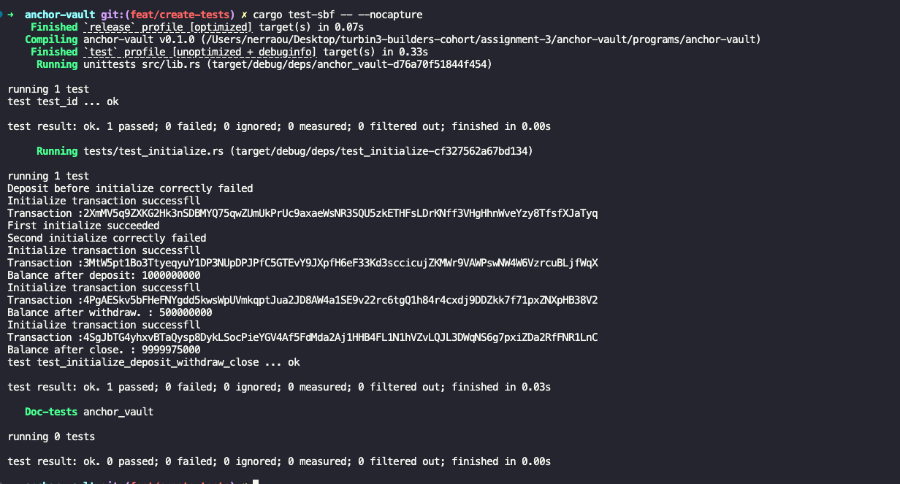

# Anchor Vault

A simple Solana vault program built with **Anchor** and tested with **LiteSVM**.

This project demonstrates core Solana program concepts:

- PDA derivation
- Account initialization
- Lamport deposits
- Secure withdrawals
- Account closing
- Anchor account constraints
- Program testing with LiteSVM

---

## Features

### Initialize

Creates:

- `vault_state` PDA
- `vault` PDA

Stores bump seeds for future validation.

---

### Deposit

Transfers lamports from the user into the vault.

Validates:

- vault exists
- correct PDA derivation

---

### Withdraw

Transfers lamports from vault back to user.

Validates:

- vault ownership
- signer authority

---

### Close

Closes:

- vault account
- vault state account

Returns remaining lamports to the owner.

---

## Tech Stack

- Rust
- Anchor
- Solana
- LiteSVM

---

## Project Structure

```txt
programs/
  anchor-vault/
    src/
      instructions/
      state/
      lib.rs
    tests/
```

---

## Run Tests

```bash
cargo test-sbf -- --nocapture
```

This prints all logs (`msg!`) to the console.

For detailed backtraces:

```bash
RUST_BACKTRACE=1 cargo test-sbf -- --nocapture
```

## Test Logs



---

## What I Learned

This project helped reinforce:

- How PDAs are derived and validated
- Difference between deriving and creating accounts
- Anchor seed constraints
- Account lifecycle management
- Writing success and failure-path tests

## Resources

[PDA](https://solana.com/docs/core/pda)
[Accounts](https://solana.com/docs/core/accounts)
[Account-Constraints](https://www.anchor-lang.com/docs/references/account-constraints#accountseeds-bump)
