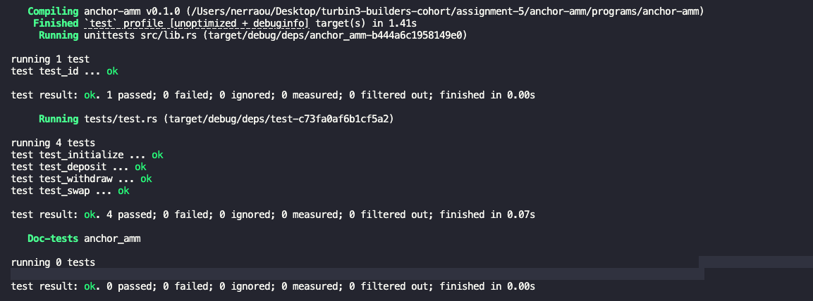
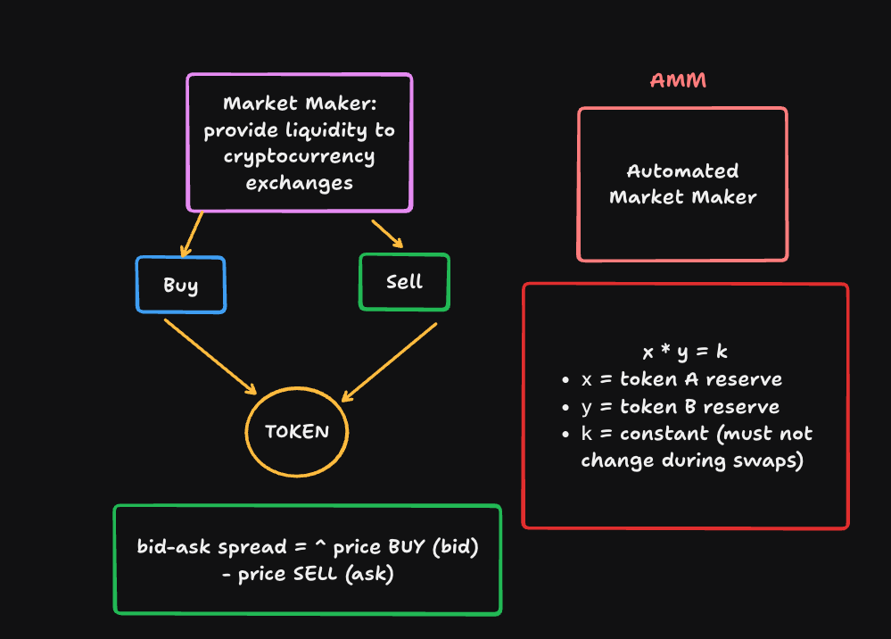

# Anchor AMM

A simple Constant Product AMM (Automated Market Maker) built with **Anchor** on **Solana**.

This project demonstrates a decentralized liquidity pool where users can:

- Deposit token pairs into a pool
- Receive LP (liquidity provider) tokens
- Withdraw liquidity proportionally
- Perform swaps using a constant product curve

---

## Features

### Initialize Pool

A pool creator initializes the AMM by:

Setting mint_x and mint_y
Creating a global Config account (PDA)
Initializing vault token accounts
Creating LP mint for liquidity tracking

The config PDA controls the entire pool state.

---

### Deposit (Add Liquidity)

Liquidity providers can deposit tokens into the pool:

Users send mint_x and mint_y tokens
Vaults receive and store tokens under the config authority
LP tokens are minted to represent pool share

LP tokens are proportional to the deposit ratio.

---

### Withdraw (Remove Liquidity)

Liquidity providers can withdraw their share:

User burns LP tokens
Pool calculates proportional x and y amounts using constant product formula
Tokens are transferred back from vaults to user

Slippage protection ensures:

Minimum x and y amounts are respected
Prevents unfair withdrawals due to price changes

---

## Tech Stack

- Rust
- Anchor
- Solana
- SPL Token Program
- LiteSvm

---

## Project Structure

```txt
programs/
  anchor-amm/
    src/
      instructions/
        initialize.rs
        deposit.rs
        withdraw.rs
        swap.rs
      state/
        config.rs
      error.rs
      lib.rs

tests/
  test.rs
```

---

## Run Tests

```bash
anchor test -- --nocapture
```

For full backtraces:

```bash
RUST_BACKTRACE=1 anchor test -- --nocapture
```

---

## Core Concepts Practiced

This project reinforces:

PDA derivation and signing
SPL token CPI (transfer, mint, burn)
Associated Token Accounts (ATA)
Constant product AMM math (x \* y = k)
Slippage protection
Liquidity pool design
Anchor account constraints
Secure token vault architecture

---

## Tests Log



## Notes


